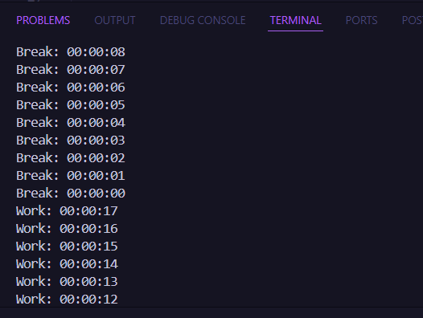

# PROJECT LATIHAN POMODORO TIMER

## _Project ini semata-mata hanya untuk latihan saja_

Aplikasi ini adalah **timer manajemen waktu kerja dan istirahat** yang berfungsi seperti **Pomodoro Timer**, menggunakan **Moment.js** untuk format waktu dan **node-notifier** untuk notifikasi. Timer berjalan secara bergantian antara kerja dan istirahat, menampilkan waktu yang tersisa, lalu memberikan notifikasi otomatis saat waktu habis untuk membantu meningkatkan fokus dan produktivitas.

## Installation

Jika anda sudah clone repo ini maka install node modules dan package-package yang akan dipakai

```sh
npm install
```

## Cara menjalankannya

1. Jalankan aplikasi dengan perintah berikut, sesuaikan angka sesuai kebutuhan (angka pertama adalah durasi kerja dalam menit, angka kedua adalah durasi istirahat dalam menit):

```sh
node index.js 25 5
```

_"Contoh di atas akan menjalankan 25 menit kerja dan 5 menit istirahat, lalu mengulang siklusnya secara otomatis."_

2.  Saat timer berjalan, waktu akan ditampilkan di terminal, dan notifikasi akan muncul saat waktunya beralih antara kerja dan istirahat.
    

Aplikasi ini membantu mengelola waktu kerja dan istirahat secara otomatis agar tetap fokus dan produktif!
